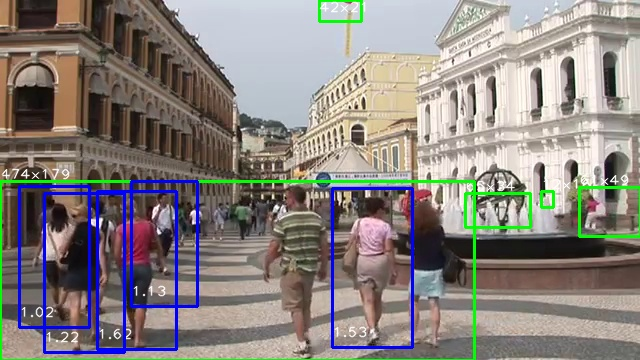
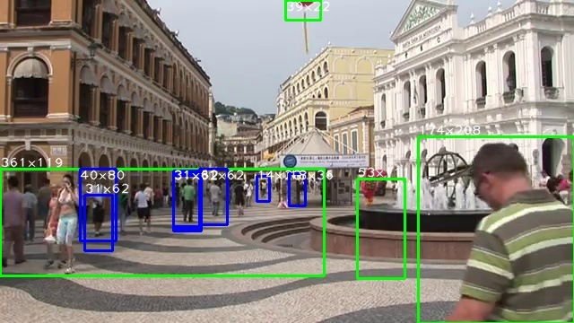
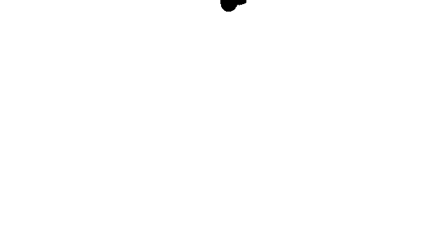

Motion Detector takes input from video sources such as network cameras, web cams, files, etc. and makes intelligent decisions based on analyzing frames. Motion Detector uses a plugin based event driven architecture that allows you to easily extend functionality. It is deployed as an intelligent security system, but can be configured for your particular scenario. Reasons to use Motion Detector:
* You have been disappointed with over priced proprietary cameras which require subscriptions to store your data. Build a [low end camera](https://bbs.nextthing.co/t/worlds-cheapest-smart-camera/16619) for 900% less than a [Nest Cam IQ](https://www.amazon.com/gp/customer-reviews/R3KW3CUJU03AB6).
* You have been disappointed with other surveillance software being Windows only (iSpy), woefully outdated (motion) or requiring a special OS image (KERBEROS.IO).
* You want to use advanced Computer Vision and Machine Learning algorithms.
* You want a secure camera [New IoT malware targets 100,000 IP cameras via known flaw](http://www.csoonline.com/article/3195825/security/new-iot-malware-targets-100000-ip-cameras-via-known-flaw.html) that does not rely on crappy proprietary firmware.
* There is no free/paid version, lame accounts to sign up for, etc. If you want extra features you can request them or write them yourself.
* If you are a developer and SBC tinkerer then the possibilities are endless.

The primary focus of Motion Detector is efficient video processing, fault tolerance and extensibility. While most security themed video monitoring is based on motion detection, Motion Detector places a high value on Computer Vision for intelligent frame analysis such as HOG pedestrian and Haar cascade multi-scale detection.

Using the pre-trained Histogram of Oriented Gradients and Linear SVM method works better when objects are larger (green is motion ROI and blue is a detected pedestrian):



Using the pre-trained Haar Cascade method works better when objects are smaller:



It's important to use the right detectors and configuration to achieve the desired results.

### Features
* Motion Detector has been tested on SBCs such as Raspberry Pi, NanoPi M1, CHIP, ODROID C1/C2/XU4, Pine A64, etc. to create compact smart cameras. That means you can run Motion Detector on a single core $9 [CHIP](https://github.com/sgjava/opencv-chip) SBC and still use pedestrian detection without any hardware acceleration.
* Threading and subprocess based architecture allows consistent FPS while processing frames, writing video files, moving files to remote location, etc. all concurrently.
* Run multiple copies on a central server for IP based "dumb" cameras.
* Supports several types of video inputs including USB and IP (wired/wireless) cameras, video files, etc.
* Fault tolerant architecture ensures buggy camera firmware or poor network connectivity will not derail video processing.
* High performance frame capture plugins including Python socket based MJPEG decoder.
* Threshold based motion detection, ignore mask, multiple object marking and video recording.
* Pedestrian and human feature detection.
* Add your own plugins.
* Single configuration file.

### Requirements
* X86, X86_64, ARMv7 or ARMv8 version of Ubuntu 16.04 or Debian 8 (will most likely work on other Linux based operating systems as well)
* Internet connection
* Camera or video file
* [Install OpenCV](https://github.com/sgjava/install-opencv) or some other method to install latest OpenCV

### Download project and test
* `sudo apt-get install git-core`
* `cd ~/`
* `git clone --depth 1 https://github.com/sgjava/motiondetector.git`
* `cd ~/motiondetector/codeferm`
* `export PYTHONPATH=$PYTHONPATH:~/motiondetector`
* `python videoloop.py`
  You should see the video process and create output in ~/motion
  
### Motion Detection
From experience I can tell you that you need to understand the usage scenario. Simple motion detection will work well with static backgrounds, but using it outside you have to deal with cars, tree branches blowing, sudden light changes, etc. This is why built in motion detection is mostly useless on security cameras for these types of scenarios. You can use ignore bitmaps and ROI (regions of interest) to improve results with dynamic backgrounds. For instance, I can ignore my palm tree, but trigger motion if you walk in my doorway.

#### Boosting Performance
I see a lot of posts on the Internet about OpenCV performance on various ARM based SBCs being CPU intensive or slow frame capture, etc. Over time I learned the tricks of the trade and kicked it up a few notches from my own research. These techniques may not work for all usage scenarios or OpenCV functions, but they do work well for security type applications.

Problem: Slow or inconsistent FPS using USB camera.

Solution: Use MJPEG compatible USB camera, mjpg-streamer and my [mjpegclient.py](https://github.com/sgjava/motiondetector/blob/master/codeferm/mjpegclient.py).

Solution: Use threading and a frame buffer to get consistent FPS from camera. Even with recording video and background events you will get very consistent FPS from cameras that allow you to set the FPS. Some cameras have dynamic FPS based on contrast and light. This can be tricky when dealing with fixed FPS video codecs.

Problem: OpenCV functions max out the CPU resulting in low FPS.

Solution: Resize image before any processing. Check out [Pedestrian Detection OpenCV](http://www.pyimagesearch.com/2015/11/09/pedestrian-detection-opencv) as it covers reduction in detection time and improved detection accuracy. The pedestrian HOG detector was trained with 64 x 128 images, so a 320x240 image is fine for some scenarios. As you go up in resolution you get even better performance versus operating on the full sized image. This article also touches on non-maxima suppression which is basically removing overlapping rectangles from detection type functions.

Solution: Sample only some frames. Motion detection using the moving average algorithm works best at around 3 or 4 FPS. This works to your advantage since that is an ideal time to do other types of detection such as for pedestrians. This also works out well as your camera FPS goes higher. That means ~3 FPS are processed even at 30 FPS. You still have to consider video recording overhead since that's still 30 FPS.

Solution: Analyze only motion ROI (regions of interest). By analyzing only ROI you can cut down processing time tremendously. For instance, if only 10% of the frame has motion then the OpenCV function should run about 900% faster! This may not work where there's a large change frame after frame. Luckily this will not happen for most security type scenarios. If a region is too small for the detector it is not processed thus speeding things up even more.

#### Run Motion Detector
The default [test.ini](https://github.com/sgjava/motiondetector/blob/master/config/test.ini) is configured to detect pedestrians from a local video file in the project. Try this first and make sure it works properly.
* `cd ~/motiondetector/codeferm`
* `export PYTHONPATH=$PYTHONPATH:~/motiondetector`
* `python videoloop.py`
* Video will record to ~/motion/test using camera name (default test), date for directory and time for file name
* This is handy for debugging issues or fine tuning using the same file over and over

Create a new configuration file for [videoloop.py](https://github.com/sgjava/motiondetector/blob/master/codeferm/videoloop.py) to suit your needs.

* `cp ~/motiondetector/config/test.ini ~/camera.ini`
* `cd ~/motiondetector/codeferm`
* `python videoloop.py ~/camera.ini`

The same test video should have processed fine with a copy of the test configuration. Now we can try the default V4L camera which is -1:

* `nano ~/camera.ini` and change the following:
    * `name` to `camera`
    * `url` to `-1`
    * `videoCaptureProperties` to `((cv2.CAP_PROP_FRAME_WIDTH, 1280), (cv2.CAP_PROP_FRAME_HEIGHT, 720))` or a resolution your camera supports.
    * `framePlugin` to `codeferm.videocapture`    
    * `detectPlugin` to empty    
    * `fps` to camera's FPS (watch output for actual FPS and tune if necessary)
    * `mark` to `False`
    * `ignoreMask` to empty    
    * `historyImage` to `True`
    
Try the new configuration:

* `cd ~/motiondetector/codeferm`
* `python videoloop.py ~/camera.ini`

videoloop should write video files to ~/motion/camera when motion is detected. You can adjust `startThreshold` and `stopThreshold` as needed. Let videoloop run and capture videos. Once you have enough samples take a look at the history images. History images use the name of the video file and add .png to the end. Take a look at the example one I created with the sample video:

 

I'm ignoring that balloon at the top center of the video. White pixels are considered for motion detection and black pixels are ignored. This only pertains to the motion detection moving average. All movement is considered for detection otherwise
you might miss an important region of interest (ROI). If you apply this to your situation you can effectively prevent a lot of false
motion detection. Trees, bushes, cars and other objects can be ignored if the fall into a particular region of the ignore mask. Use the history image as the basis of your ignore mask. It's **important** not to move the camera after the mask is created or it will not be aligned properly.

Of course, you can leave `ignoreMask` empty if you wish to analyze the entire frame for motion.

If you wish to use the SCP plugin then you should generate ssh keypair, so you do not have to pass passwords around or save them in a file. It's handy to scp video files to a central server or cloud storage after detection.
* ssh-keygen
* ssh-copy-id user@host
* ssh host

### Configure Supervisor
To make Motion Detector more resilient it's wise to run it with a process control system like [Supervisor](http://supervisord.org). Motion Detector currently fails fast if it gets a bad frame or socket timeout (as long as you use a reasonable socket timeout value in the configuration). Supervisor will automatically restart videoloop.py after failure.
* `sudo apt-get install supervisor`
* `sudo service supervisor start`
* `sudo nano /etc/supervisor/conf.d/videoloop.conf`
```
[program:videoloop]
command = python videoloop.py /path/to/your/config.ini
directory = /home/<username>/motiondetector/codeferm
user = <username>
startsecs = 0
autostart = true  
autorestart = true  
stdout_logfile = /var/log/supervisor/videoloop.log  
stderr_logfile = /var/log/supervisor/videoloop_err.log
environment = PYTHONPATH=/home/<username>/motiondetector
```
   
* `sudo supervisorctl update`
* `tail /var/log/supervisor/videoloop.log`

If you plan on using mjpg-streamer have Supervisor take care of that as well.

* `sudo nano /etc/supervisor/conf.d/mjpg-streamer.conf`
```
[program:mjpg-streamer]
command = mjpg_streamer -i "/usr/local/lib/input_uvc.so -n -f 5 -r 1280x720" -o "/usr/local/lib/output_http.so -w /usr/local/www"
directory = /home/<username>
user = <username>
startsecs = 0
autostart = true  
autorestart = true  
stdout_logfile = /var/log/supervisor/mjpg-streamer.log  
stderr_logfile = /var/log/supervisor/mjpg-streamer.log  
environment = LD_LIBRARY_PATH=/opt/libjpeg-turbo/lib32 (or lib64 for 64 bit)
```
   
* `sudo supervisorctl update`
* `tail /var/log/supervisor/mjpg-streamer.log`

### Camera health check

If you want to monitor the health of Motion Detector you just need to look at health.txt timestamp. For example, if I want to use Zabbix agent I could add the following to zabbix_agentd.conf

```
# Camera health
UserParameter=camhealth,if test `find "/home/servadmin/motion/health.txt" -mmin -2`; then echo "1"; else echo "0"; fi
```

### FreeBSD License
Copyright (c) Steven P. Goldsmith

All rights reserved.

Redistribution and use in source and binary forms, with or without modification, are permitted provided that the following conditions are met:
* Redistributions of source code must retain the above copyright notice, this list of conditions and the following disclaimer.
* Redistributions in binary form must reproduce the above copyright notice, this list of conditions and the following disclaimer in the documentation and/or other materials provided with the distribution.

THIS SOFTWARE IS PROVIDED BY THE COPYRIGHT HOLDERS AND CONTRIBUTORS "AS IS" AND ANY EXPRESS OR IMPLIED WARRANTIES, INCLUDING, BUT NOT LIMITED TO, THE IMPLIED WARRANTIES OF MERCHANTABILITY AND FITNESS FOR A PARTICULAR PURPOSE ARE DISCLAIMED. IN NO EVENT SHALL THE COPYRIGHT HOLDER OR CONTRIBUTORS BE LIABLE FOR ANY DIRECT, INDIRECT, INCIDENTAL, SPECIAL, EXEMPLARY, OR CONSEQUENTIAL DAMAGES (INCLUDING, BUT NOT LIMITED TO, PROCUREMENT OF SUBSTITUTE GOODS OR SERVICES; LOSS OF USE, DATA, OR PROFITS; OR BUSINESS INTERRUPTION) HOWEVER CAUSED AND ON ANY THEORY OF LIABILITY, WHETHER IN CONTRACT, STRICT LIABILITY, OR TORT (INCLUDING NEGLIGENCE OR OTHERWISE) ARISING IN ANY WAY OUT OF THE USE OF THIS SOFTWARE, EVEN IF ADVISED OF THE POSSIBILITY OF SUCH DAMAGE.
